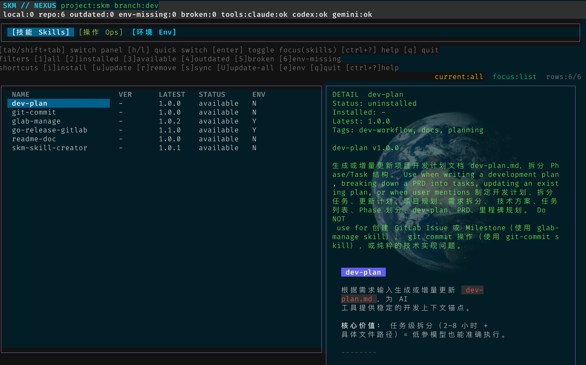

# aic skills

公司内部 AI Skill 仓库与 `aic`（Skill Manager）工具源码，统一管理 Claude Code / Codex CLI / Gemini CLI 的项目级技能能力。

- 仓库：`git@git.ifogging.cn:rd/op/skills.git`
- 组成：`skills/`（技能库）+ `aic/`（管理工具）

## 1. 项目背景与要解决的问题

### 1.1 背景

2026 年 AI 工程从“只看模型能力”转向“模型 + 系统约束”的工程范式：

`Agent = Model + Harness`

其中 Harness 不是单点能力，而是一整套可执行的工程系统：

- 记忆与上下文管理
- 工具与技能（Skill）
- 编排与协作
- 基础设施与权限边界
- 评估与验证闭环
- 执行追踪与可观测性

在这个范式下，Skill 的价值是把高频、可标准化的操作从“临场推理”变成“结构化执行”。

### 1.2 Harness 与“模型能力至上”差异

在工程实践里，Harness 更强调“系统收敛能力”，而不只看模型上限：

- 能力至上 vs 系统收敛：模型“能做”不等于“稳定做到”
- 规则理解 vs 规则执行：仅靠 Prompt 约束，常出现“理解但不遵守”
- 静态数据飞轮 vs 运行时飞轮：高质量执行轨迹本身就是可复用数据资产

Skill 在这套理论中的定位是“将不确定推理转成确定流程”的承重模块：把工具调用、参数校验、异常处理、结果格式固定在系统层执行。

### 1.3 当前痛点

在没有统一管理前，团队常见问题：

- 同一份 Skill 需要在多个工具目录重复维护，更新容易遗漏
- 新成员或新工具接入没有标准初始化流程
- 缺少统一版本与分发机制，项目间能力难复用
- 含敏感变量的 Skill 缺少规范注入机制

### 1.4 本项目解决方案

本仓库通过两层体系解决上述问题：

- `skills/`：公司内部 Skill 唯一来源（统一版本、统一索引、统一规范）
- `aic/`：本机工具，负责安装、同步、软链接分发、环境变量渲染、TUI 管理

### Registry 与 aic 版本

- 根目录 `VERSION` 是 registry 自身版本，用于标识 registry 内容的发布状态。
- 根目录 `aic-release.yaml` 记录 aic 版本、二进制 MD5 和中文更新列表；`registry.yaml` 通过 `aic_release` 字段指向该文件。
- aic 拉取 registry 后应读取该文件，将自身版本与 `version` 精确比较；不一致时展示 `features` 并提示升级。

维护命令：

```bash
make set-version VERSION=v0.2.0
```

## 2. 目前集成的 Skills

当前注册表（`skills/index.yaml`）已集成以下技能：


| Skill               | 版本    | 分类   | 作用简介                                                        | 是否依赖 Env |
| ------------------- | ------- | ------ | --------------------------------------------------------------- | ------------ |
| `dev-plan`          | `1.0.0` | domain | 生成/增量更新`dev-plan.md`，按 Phase/Task 拆解开发计划          | 否           |
| `git-commit`        | `1.0.0` | common | 基于暂存变更与上下文生成规范中文 commit message 并提交          | 否           |
| `glab-manage`       | `1.0.2` | common | 按开发计划在 GitLab 创建 Milestone/Issue 并回写编号             | 是           |
| `go-release-gitlab` | `1.1.0` | common | go 程序本地交叉编译打包并发布到 GitLab Release                  | 是           |
| `aic-skill-creator` | `1.0.1` | common | 编写/优化 aic 内部`SKILL.md` 的设计与触发描述                   | 否           |
| `readme-doc`        | `1.0.1` | common | 生成本地格式化的 README.md 文件                                 | 否           |
| `k8s-deploy`        | `1.0.1` | common | 生成全量 k8s.yaml + 增量 update.yaml                            | 否           |
| `docker-deploy`     | `1.0.1` | common | 生成 Dockerfile + docker-compose.yml + build.sh + .dockerignore | 否           |
| `cicd-pipeline`     | `1.0.1` | common | 生成/维护 .gitlab-ci.yml                                        | 否           |

说明：

- `Env=是` 的 Skill 需要在项目级或全局环境中配置变量（由 `aic env` 管理）。
- 具体触发语义与用法见各 Skill 目录下 `SKILL.md`。

### skill 工作流

如何把这些 skill 串联成一个有序工作流

```yaml
需求文档 → dev-plan（拆分任务）
           → glab-manage（创建 Issue/Milestone）
           → challenge（审查代码）
           → git-commit（规范提交）
           → dev-plan（归档 Phase）
```

通过工作流的设计将这些 skill 串联起来，实现从需求到部署的全生命周期管理,同时构建 可 gitlab 托管的项目级上下文状态存储。

## 3. 安装方式

### 3.1 一键安装 aic（推荐）

#### Version 1.0.1

```bash
curl -fsSL http://62.234.2.75:58089/aic/v1.0.1/install.sh | sh
```

#### Version 1.0.2

```bash
curl -fsSL http://62.234.2.75:58089/aic/v1.0.2/install.sh | sh
```

### 3.2 本地源码构建

```bash
cd aic
make build
./bin/aic --help
```

### 3.3 项目初始化与首轮安装

**在业务项目根目录执行:**

```bash
aic init
aic
```

常见命令：

```bash
aic install git-commit
aic sync
aic env check
```

### 3.4 其他工具兼容性（基于 `.agents/skills/`）

`aic` 的通用适配锚点是项目目录下的 `.agents/skills/`。只要工具支持从该目录加载 Skill，就可以直接复用 `aic install / sync / env` 的管理能力。

- `Cursor CLI`：将 Skill 加载目录指向 `<project>/.agents/skills/` 后即可接入；模型侧可配置官方 API 或国产 API 兼容端点（OpenAI-compatible endpoint），不影响 `aic` 的使用。
- `OpenCode`：同样使用 `<project>/.agents/skills/` 作为 Skill 来源；完成国产 API 配置接入后，可与 `aic` 管理的 Skill 体系直接适配。
- `aic` 关注点是 Skill 生命周期与本地渲染，不绑定具体模型供应商；API 切换在工具侧完成即可。

## 4. TUI 界面使用说明（`aic`）



### 4.1 进入方式

以下命令在交互终端（TTY）下默认进入 TUI：

```bash
aic
aic tui
aic list
```

### 4.2 界面结构

TUI 由以下面板组成：

- `[技能 Skills]`：查看本地/仓库状态，执行安装、更新、移除、同步
- `[操作 Ops]`：执行项目级操作（init/sync/check updates/update all/env check/re-render/env edit）
- `[环境 Env]`：按 skill 维度查看变量，支持新增、编辑、校验、重渲染
- `[供应商 Provider]`：管理 Claude / Codex / Gemini 多供应商配置切换

Skills 面板核心状态：

- `installed`
- `available`
- `outdated`
- `broken`
- `env-missing`

### 4.3 快捷键

全局：

- `tab` / `shift+tab`：切换面板（Skills / Ops / Env / Permission / Provider）
- `h` / `l`：快速切换面板
- `ctrl+?` / `ctrl+/` / `f1`：打开/关闭帮助
- `q` 或 `ctrl+z`：退出确认
- `ctrl+c`：立即退出

Skills 面板：

- `↑/↓`：选择 Skill
- `enter`：切换 list/detail 焦点
- `1..6`：状态过滤（all/installed/available/outdated/broken/env-missing）
- `i`：安装当前 Skill
- `u`：更新当前 Skill
- `r`：移除当前 Skill（带确认）
- `s`：同步
- `U`：更新全部
- `e`：跳转 Env 面板

Detail（详情）焦点下：

- `j/k` 或 `↑/↓`：逐行滚动
- `g/G`：跳转顶部/底部
- `esc`：返回列表焦点

Ops 面板：

- `↑/↓`：选择操作
- `enter`：执行操作

Env 面板：

- `↑/↓`：选择变量项
- `enter` / `e`：编辑当前变量
- `a`：新增变量
- `c`：变量完整性检查
- `r`：重渲染 env-required skills

Env 编辑弹窗：

- `tab` / `shift+tab`：切换字段（Key / Value / Target）
- `←/→`（或 `h/l`）切换写入目标（`project` / `global`）
- `enter` 或 `ctrl+s`：保存
- `esc`：取消

Provider 面板：

- `←/→`：切换子标签（Claude / Codex / Gemini）
- `↑/↓`：选择目标 Provider
- `enter` 或 `s`：触发切换确认
- 切换后自动完成配置备份与替换，需重启对应工具生效

## 5. 仓库结构

```text
.
├── skills/          # 内部 Skill 库（含 index.yaml）
├── aic/             # aic 工具源码（Go）
├── docs/            # 仓库级文档
└── README.md
```

## 6. 参考文档

- `aic` 详细命令文档：[`aic/README.md`](aic/README.md)
- Makefile 工程化说明：[`aic/docs/makefile.md`](aic/docs/makefile.md)
- 开发计划与里程碑：[`dev-plan.md`](dev-plan.md)
