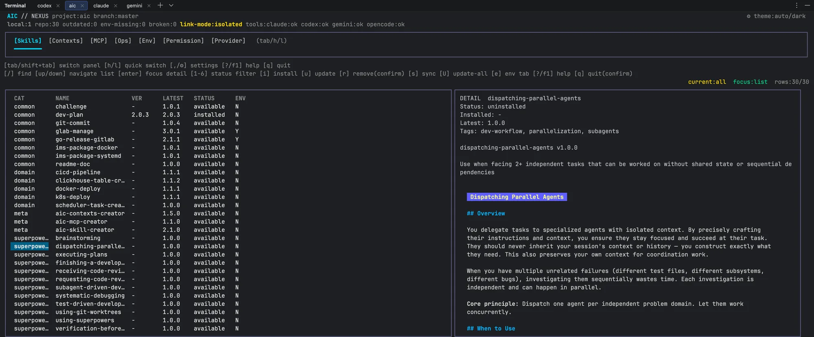

**English** | [简体中文](./README.zh-CN.md)

# aic-registry

Official site: [aic](https://aic-web-921.pages.dev/)

> **Public Registry and content repository for aic.**
> aic itself is a local-first AI coding configuration manager (closed-source, free for personal use). The binary is distributed via Releases in this repository.

- GitHub (overseas): https://github.com/KaiyuanEra/aic-registry
- Gitee (China primary): https://gitee.com/KaiyuanEra/aic-registry

## 1. What is aic

aic is a **local-first AI coding configuration manager** with a unified TUI as its primary entry point. It manages Skills, Context, MCP servers, environment variables, permissions, and providers for Claude Code, Codex CLI, Gemini CLI, and OpenCode — all from one terminal UI that fits naturally into your workflow.

- **TUI is the primary entry point**: Skills / Contexts / MCP / Ops / Env / Permission / Provider — 7 panels.
- **Local-first**: project config lives in `<project>/.aic/`, user config in `~/.aic/`, sensitive env values are never stored in a database.
- **Portable**: team conventions travel with the project — new members clone and `aic sync` to restore the full setup.
- **Restrained**: no accounts, no cloud sync, no billing, no paywalls.

<picture>
  <source media="(prefers-color-scheme: dark)" srcset="assets/tui-hero-dark.webp">
  
</picture>

For full introduction, concepts, keybindings, and troubleshooting, visit the **aic documentation site**:

> Site URL will be filled in after Cloudflare Pages deployment.

## 2. What this repository is (and isn't)

This repository is **not a marketplace**. It is a reference registry that ships with a small set of conventions and engineering samples.

**The intended workflow is fork-and-own:**

1. **Fork** this repository to your own private repo or team workspace.
2. **Customize** — add your own Skills, Contexts, MCP server templates, Provider configs, and permission rules. Remove what you don't need.
3. **Point `aic` at your fork** via the TUI settings panel (`Settings → Registry URL`) or `~/.aic/config.toml`.
4. **Use `aic sync`** to pull your team's conventions into every project.

The value proposition is **personal, private, or team-internal use**: you maintain one source of truth for your AI coding configuration, and every project you work on inherits the same setup.

What this repository provides:

- A **convention / schema** for how Skills, Contexts, MCP servers, Providers, and permissions are organized.
- A **small set of sample skills** (dev-plan, git-commit, docker-deploy, etc.) that you can keep, modify, or replace.
- **Provider example configs** for Claude / Codex / Gemini / OpenCode as a starting point.

What it does **not** provide:

- A public marketplace or app store for Skills.
- Hosted / cloud-synced registry services.
- Guaranteed compatibility or support for third-party skills you add to your own fork.
- **Adapted open-source skills** — useful skills from the open-source community, translated with proper versioning and
  private-variable adaptation, curated as reusable engineering assets. Use the registry's built-in `aic-skill-creator`,
  `aic-contexts-creator`, and `aic-mcp-creator` tools for authoring and schema validation.

>  Important: after modifying any version number, run make index in the root directory to regenerate and validate
skills/index.yaml, contexts/index.yaml, and other index files, ensuring Registry metadata stays consistent with actual
content.

> You are encouraged to treat your fork as the authoritative registry for yourself or your team. This public repository is just the starting point.

## 3. Installation

### macOS / Linux

Download the archive for your platform from the Release page and extract it to your PATH:

- GitHub Releases (overseas): https://github.com/KaiyuanEra/aic-registry/releases
- Gitee Releases (China): https://gitee.com/KaiyuanEra/aic-registry/releases

```bash
# Example: macOS arm64
tar -xzf aic_<version>_darwin_arm64.tar.gz
sudo mv aic /usr/local/bin/
aic --version
```

> A one-line install script (with Gitee / GitHub mirror switching and version pinning) is in preparation.

### Windows (Beta)

Windows is currently in Beta: one-line install and `tar.gz` release packages are not yet supported. Without administrator privileges or Developer Mode, skill distribution falls back to managed-directory copy sync instead of creating symlinks.

### First run

Run in the **root directory of your project**:

```bash
aic init
aic
```

`aic` launches the TUI. From there you can install skills, sync configuration, manage providers, and run project-level operations via the Ops panel.

> After installing new Skills / MCPs / Contexts, or changing providers / permissions, you must **restart the corresponding AI tool client** (Claude Code / Codex CLI / Gemini CLI / OpenCode) for changes to take effect. To preserve conversation context, restart via the resume / continue feature.

### Configure the Registry source

Press `,` (comma) inside `aic` or click the ⚙ gear icon in the top-right corner to open Settings, and choose the Registry source that matches your network environment:

- **Overseas (default)** — `Registry URL`: `https://github.com/KaiyuanEra/aic-registry`, `Registry Branch`: `en` (optional)
- **China** — `Registry URL`: `https://gitee.com/KaiyuanEra/aic-registry`, `Registry Branch`: `zh` (optional)

If the skill list fails to load (network timeout, empty result, or mirror unreachable), switch the `Registry URL` between the two mirrors above and try again.

For the full quick start, command reference, and configuration paths, see the "Quick Start" and "Keybindings & Commands" pages on the aic documentation site.

## 4. Registry contents

This repository is the public Registry and content repository for aic, providing templates consumable by `aic install` / `aic sync`:

### Skills

The registry (`skills/index.yaml`) currently includes the following skills, organized by category:


| Category      | Skill                            | Summary                                                                        |
| ------------- | -------------------------------- | ------------------------------------------------------------------------------ |
| `common`      | `challenge`                      | Review code from a stranger's perspective; rank risks by severity              |
| `common`      | `dev-plan`                       | Generate / incrementally update`dev-plan.md` with Phase/Task structure         |
| `common`      | `git-commit`                     | Generate conventional Chinese commit messages from staged changes              |
| `common`      | `glab-manage`                    | Create GitLab issues from a dev plan and write back issue numbers              |
| `common`      | `readme-doc`                     | Generate a formatted README.md for a project                                   |
| `domain`      | `docker-deploy`                  | Generate Dockerfile + docker-compose.yml + build.sh + .dockerignore            |
| `domain`      | `k8s-deploy`                     | Generate full k8s.yaml + incremental update.yaml                               |
| `meta`        | `aic-contexts-creator`           | Create, migrate, and incrementally update context packages for the registry    |
| `meta`        | `aic-mcp-creator`                | Create, review, and incrementally update MCP server packages for the registry  |
| `meta`        | `aic-skill-creator`              | Write, design, and improve aic's internal`SKILL.md` files                      |
| `superpowers` | `brainstorming`                  | Explore user intent, requirements, and design before implementation            |
| `superpowers` | `systematic-debugging`           | Systematic troubleshooting flow for bugs / test failures / unexpected behavior |
| `superpowers` | `test-driven-development`        | TDD flow: write tests before implementation                                    |
| `superpowers` | `verification-before-completion` | Run verification commands and confirm output before claiming work is done      |
| `superpowers` | `writing-plans`                  | Write implementation plans for multi-step tasks                                |
| `superpowers` | `using-git-worktrees`            | Isolate workspaces via git worktree                                            |
| `superpowers` | `dispatching-parallel-agents`    | Dispatch multiple sub-agents in parallel for independent tasks                 |
| `superpowers` | `executing-plans`                | Execute implementation plans in a separate session with review checkpoints     |
| `superpowers` | `subagent-driven-development`    | Execute implementation plans with sub-agents in the current session            |
| `superpowers` | `finishing-a-development-branch` | Decide how to integrate work after implementation is complete                  |
| `superpowers` | `requesting-code-review`         | Request code review after completing tasks / before merging                    |
| `superpowers` | `receiving-code-review`          | Process code review feedback with technical rigor                              |
| `superpowers` | `writing-skills`                 | Create, edit, and verify skills                                                |
| `superpowers` | `using-superpowers`              | Establish skill discovery and usage at the start of a session                  |

For the full index and each skill's trigger semantics, see `skills/index.yaml` and the `SKILL.md` in each skill directory.

### Contexts

Project-level long-term memory templates, organized by development stage:

- `01-incubation-prototype` — Incubation / prototype stage
- `02-iteration-evolution` — Iterative evolution stage
- `03-maintenance-stable` — Maintenance / stable stage
- `04-refactor-evolution` — Refactor evolution stage
- `project-coding-guideline` — Project coding guideline template

### MCP Servers

MCP server templates installable via `aic mcp install`:

- `codegraph`
- `searxng-http`

### Providers

Provider example configurations for the four AI tools, used by `aic`'s provider multi-model switching:

- `providers/claude/`
- `providers/codex/`
- `providers/gemini/`
- `providers/opencode/`

### Other

- `permissions/` — Permission templates
- `gitignore/` — Local ignore rule templates

## 5. Repository structure

```text
.
├── skills/          # Public skill library (with index.yaml)
├── contexts/        # Context templates (by development stage)
├── mcp-servers/     # MCP server templates
├── providers/       # Provider example configs (claude / codex / gemini / opencode)
├── permissions/     # Permission templates
├── gitignore/       # Local ignore rule templates
├── docs/            # Repository-level documentation
├── scripts/         # Index generation and other utility scripts
├── registry.yaml    # Registry metadata
├── aic-release.yaml # aic version, MD5, and changelog
├── VERSION          # Registry's own version
└── README.md
```

> **Note**: The aic binary is closed-source. This repository does **not** contain aic source code. It only holds Registry content (Skills / Contexts / MCP / Providers templates) and release metadata.

## 6. Registry and aic versions

- The root `VERSION` file is the registry's own version, indicating the release state of registry content.
- The root `aic-release.yaml` records the aic version, binary MD5, and Chinese changelog; `registry.yaml` points to it via the `aic_release` field.
- After pulling the registry, aic reads this file and compares its own version with `version`; if they differ, it displays `features` and prompts for an upgrade.

Maintenance command:

```bash
make set-version VERSION=v0.2.0
```

## 7. Contributing & feedback

- **Issues**: file issues on GitHub or Gitee
  - GitHub Issues: https://github.com/KaiyuanEra/aic-registry/issues
  - Gitee Issues: https://gitee.com/KaiyuanEra/aic-registry/issues
- **Email**: kaiyuanera@zohomail.com
- **Documentation site**: visit the aic documentation site for full docs (link to be filled in after Cloudflare Pages deployment)

## License

The Skills / Contexts / MCP server / Provider templates and other content in this repository are publicly usable.
